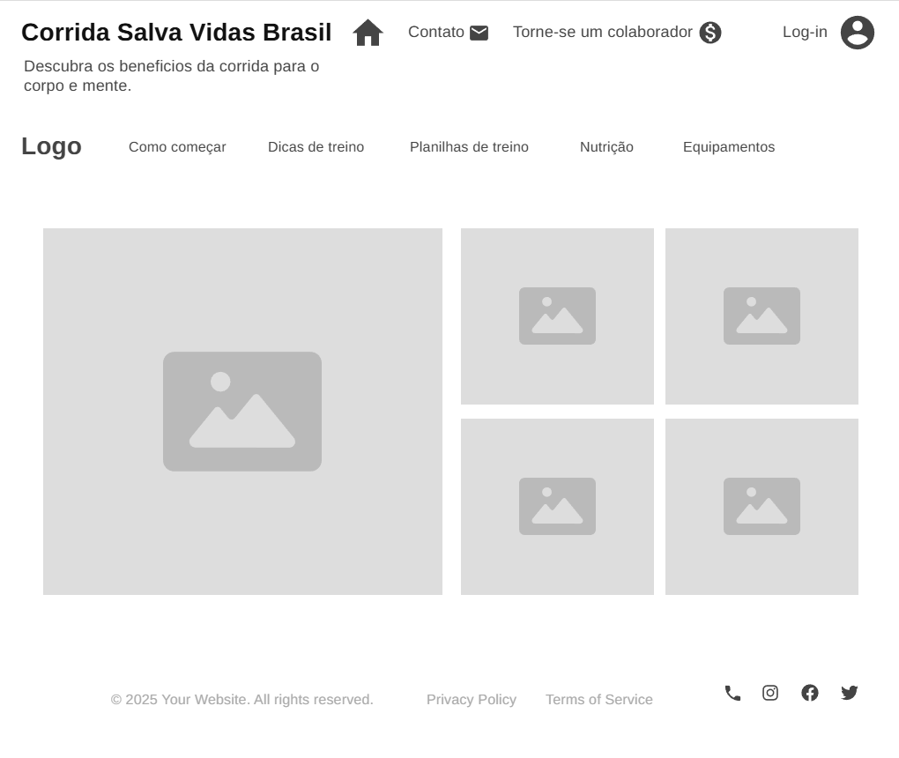
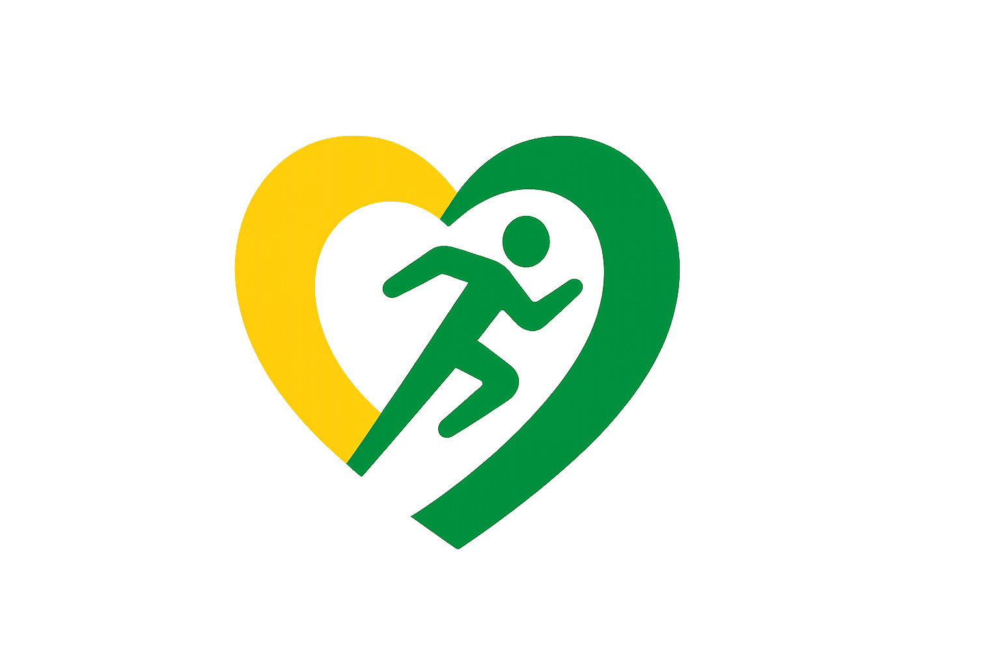

# Corrida Salva Vidas Brasil
Matheus Augusto Lamussi Daens - 10426754

## Processo de ideação
O tema corrida/saúde foi escolhido por já fazer parte da minha vida, e também por se encaixar perfeitamente em um caráter extensionista. Primeiramente foi pensando em um website estilo 'blog', com uma área focada em e-commerce, porém, para evitar confusões e ser mais direto ao tema de projeto extesionista, decidi focar 100% em um blog de corrida voltado para saúde.

No topo site teremos o <header> que estará sempre fixo no topo da página, independente da rolagem. Nele está contido o título do site, Corrida Salva Vidas Brasil, e também está incluso alguns botões como 'contato', botão de doações, e também de acesso ao perfil do site. Além de todas essas opções, temos o botão principal 'home', que leva diretamente à página principal.
Agora na 'home' do nosso site, temos uma <nav> na horizontal, que contém a logo da Corrida Salva Vidas Brasil e alguns links. Cada um desses links levará o usuário a uma página diferente, cada uma contendo assuntos específicos.
Abaixo do nav, foi usado uma <section> para armazenar diferentes fotos e conteúdos, que ficaram em rotação até que o usuário aperte algum link.
No fim da página, fica o <footer>, com algumas informações importantes e também maneiras de contatar a 'organização', como redes sociais e número de telefone.

## Logo do site

